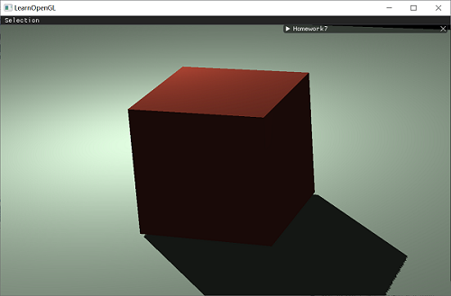

# Homework 7 - Shadowing Mapping
## Introduction
    相信大家在课堂上也体会到阴影对场景渲染真实性的重要性。本次作业大家将要实现Shadowing Mapping，并尽可能去优化。本次作业量较大，也希望大家能在彻底理解Shadowing Mapping的算法后再开始编程实现。

## References
## 1. 阴影渲染

阴影渲染两大基本步骤：
* 1)以光源视角渲染场景，得到深度图(DepthMap)，并存储为texture；
* 2)以camera视角渲染场景，使用Shadowing Mapping算法(比较当前深度值与在DepthMap Texture的深度值)，决定某个点是否在阴影下。

## 2. 阴影优化
* [阴影锯齿消除](https://learnopengl-cn.github.io/05%20Advanced%20Lighting/03%20Shadows/01%20Shadow%20Mapping/#pcf)
* [Common Techniques to Improve Shadow Depth Maps - Microsoft](https://msdn.microsoft.com/en-us/library/windows/desktop/ee416324%28v=vs.85%29.aspx)

# Homework
## Basic:
### 1. 实现方向光源的Shadowing Mapping:
* 要求场景中至少有一个object和一块平面(用于显示shadow)  
* 光源的投影方式任选其一即可  
* 在报告里结合代码，解释Shadowing Mapping算法  

### Shadowing Mapping实现效果如图
  
采用了正交投影，能看出效果不是很好，后面需要继续进行优化

### 实现过程
#### 1. 上次作业已经绘制了光源、立方体，现在需要绘制地板平面
地板仍然沿用立方体的顶点数组，设置一下模型矩阵，将其沿x、z轴放大10倍，y轴缩小十倍，位置平移到贴立方体下面，从而达到地板的效果
```
	//绘制地板
	model = glm::mat4(1.0f);
	model = glm::translate(model, glm::vec3(0.0f, -2.0f, 0.0f)); // 向下平移
	model = glm::scale(model, glm::vec3(10.0f, 0.1f, 10.0f)); // 缩放
	shadowShader.setMat4("model", model);
	shadowShader.setVec3("objectColor", 0.8f, 0.9f, 0.8f); // 物体颜色
```

#### 2. 阴影映射(Shadow Mapping)
**阴影映射(Shadow Mapping)** 的思路非常简单：以光的位置为视角进行渲染，我们能看到的东西都将被点亮，看不见的就在阴影之中。假设有一个地板，在光源和它之间有一个大盒子。由于光源处向光线方向看去，可以看到这个盒子，但看不到地板的一部分，这部分就应该在阴影中。  
  
它的实现两个步骤组成：首先，我们渲染深度贴图，然后像之前一样渲染场景，使用生成的深度贴图来计算片元是否在阴影之中。  

#### 深度贴图（depth map）
从光源的透视图来渲染场景，并把深度值的结果储存到纹理中。通过这种方式，就能对光源的透视图所见的最近的深度值进行采样。最终，深度值就会显示从光源的透视图下见到的第一个片元。  
储存在纹理中的所有这些深度值，叫做**深度贴图（depth map）**或**阴影贴图**。  
  
使用一个来自光源的视图和投影矩阵来渲染场景就能创建一个深度贴图。这个投影和视图矩阵结合在一起成为一个TT变换，它可以将任何三维位置转变到光源的可见坐标空间。
第一步我们需要生成一张深度贴图(Depth Map)。深度贴图是从光的透视图里渲染的深度纹理，用它计算阴影。这里需要将场景的渲染结果储存到一个纹理中，因此需要帧缓冲。  
为渲染的深度贴图创建一个帧缓冲对象：
```
GLuint depthMapFBO;
glGenFramebuffers(1, &depthMapFBO);
```  

创建一个2D纹理，提供给帧缓冲的深度缓冲使用  
把纹理格式指定为GL_DEPTH_COMPONENT。还要把纹理的高宽设置为1024：这是深度贴图的解析度。
```
const GLuint SHADOW_WIDTH = 1024, SHADOW_HEIGHT = 1024;

GLuint depthMap;
glGenTextures(1, &depthMap);
glBindTexture(GL_TEXTURE_2D, depthMap);
glTexImage2D(GL_TEXTURE_2D, 0, GL_DEPTH_COMPONENT, 
             SHADOW_WIDTH, SHADOW_HEIGHT, 0, GL_DEPTH_COMPONENT, GL_FLOAT, NULL);
glTexParameteri(GL_TEXTURE_2D, GL_TEXTURE_MIN_FILTER, GL_NEAREST);
glTexParameteri(GL_TEXTURE_2D, GL_TEXTURE_MAG_FILTER, GL_NEAREST);
glTexParameteri(GL_TEXTURE_2D, GL_TEXTURE_WRAP_S, GL_REPEAT); 
glTexParameteri(GL_TEXTURE_2D, GL_TEXTURE_WRAP_T, GL_REPEAT);
```  

把生成的深度纹理作为帧缓冲的深度缓冲。这里只需要深度信息，所以颜色缓冲没有用，调用glDrawBuffer和glReadBuffer把读和绘制缓冲设置为GL_NONE。  
```
glBindFramebuffer(GL_FRAMEBUFFER, depthMapFBO);
glFramebufferTexture2D(GL_FRAMEBUFFER, GL_DEPTH_ATTACHMENT, GL_TEXTURE_2D, depthMap, 0);
glDrawBuffer(GL_NONE);
glReadBuffer(GL_NONE);
glBindFramebuffer(GL_FRAMEBUFFER, 0);
```  

下面生成深度贴图。  
首先调用glViewport改变视口，以适应阴影贴图的尺寸。
```
	glViewport(0, 0, SHADOW_WIDTH, SHADOW_HEIGHT);
	glBindFramebuffer(GL_FRAMEBUFFER, depthMapFBO);
```

**光源空间的变换**
这里光源使用正交投影矩阵，透视图将没有任何变形
```
GLfloat near_plane = 1.0f, far_plane = 100.0f;
glm::mat4 lightProjection = glm::ortho(-20.0f, 20.0f, -20.0f, 20.0f, near_plane, far_plane);
```  
这里投影矩阵间接决定可视区域的范围，需要保证投影视锥（frustum）的大小，能包含打算在深度贴图中包含的物体。观察不同参数下的效果，最终调整为以上参数。  

使用glm::lookAt函数创建一个视图矩阵来变换每个物体，这次从光源的位置看向场景中央。
```
glm::mat4 lightView = glm::lookAt(lightPos, glm::vec3(0.0f), glm::vec3(1.0));
```  
二者相结合得到一个光空间的变换矩阵，它将每个世界空间坐标变换到光源处所见到的那个空间
```
glm::mat4 lightSpaceMatrix = lightProjection * lightView;
```  
有了lightSpaceMatrix只要给着色器提供光空间的投影和视图矩阵，就能像之前那样渲染场景。

**渲染至深度贴图**  
以光的透视图进行场景渲染的时候，使用一个比较简单的着色器`simpleDepthShader`，它只需要把顶点变换到光空间。  
顶点着色器：
```
#version 330 core
layout (location = 0) in vec3 position;

uniform mat4 lightSpaceMatrix;
uniform mat4 model;

void main()
{
    gl_Position = lightSpaceMatrix * model * vec4(position, 1.0f);
}
```

片段着色器什么也不干，运行完后，深度缓冲会被更新。  
```
#version 330 core

void main()
{             
    // gl_FragDepth = gl_FragCoord.z;
}
```

接下来渲染深度缓冲
```
	glClear(GL_DEPTH_BUFFER_BIT);
	depthShader.use();
	depthShader.setMat4("lightSpaceMatrix", lightSpaceMatrix);
	//绘制立方体
	model = glm::mat4(1.0f);
	depthShader.setMat4("model", model);
	glBindVertexArray(cubeVAO);
	glDrawArrays(GL_TRIANGLES, 0, 36);
	//绘制平面
	model = glm::mat4(1.0f);
	model = glm::translate(model, glm::vec3(0.0f, -2.0f, 0.0f)); // 向下平移
	model = glm::scale(model, glm::vec3(10.0f, 0.1f, 10.0f)); // 打扁
	depthShader.setMat4("model", model);
	glBindVertexArray(cubeVAO);
	glDrawArrays(GL_TRIANGLES, 0, 36);
	glBindFramebuffer(GL_FRAMEBUFFER, 0);
```

**渲染阴影**  
首先顶点着色器增加FragPosLightSpace这个输出向量。用同一个lightSpaceMatrix，把世界空间顶点位置转换为光空间。顶点着色器传递一个普通的经变换的世界空间顶点位置FragPos和一个光空间的  FragPosLightSpace给像素着色器。
```
#version 330 core
layout (location = 0) in vec3 aPos;
layout (location = 1) in vec3 aNormal;

uniform mat4 model;
uniform mat4 view;
uniform mat4 projection;
uniform mat4 lightSpaceMatrix;

out vec3 FragPos;  
out vec3 Normal;
out vec4 FragPosLightSpace;

void main()
{
   gl_Position = projection * view * model * vec4(aPos, 1.0);
   FragPos = vec3(model * vec4(aPos, 1.0));
   Normal = mat3(transpose(inverse(model))) * aNormal;
   FragPosLightSpace = lightSpaceMatrix * vec4(FragPos, 1.0);
}
```  

片段着色器仍使用上次作业的Phong光照模型渲染场景。  
新增两个输入，一个是光空间的片元位置和第一个渲染阶段得到的深度贴图。  
```
in vec3 FragPos;
in vec4 FragPosLightSpace;
```
声明一个shadowCalculation函数来计算阴影。diffuse和specular乘以(1-阴影元素)，表示这个片元有多大成分不在阴影中。因为环境光照会一直存在，所以把ambient分量从乘法中剔除。  
首先进行一个透视除法，将裁切空间坐标的范围-w到w转为-1到1，这一步主要是为了保证在透视投影下阴影也有效  
```
vec3 projCoords = fragPosLightSpace.xyz / fragPosLightSpace.w;
```  
下面将projCoords向量变换到[0,1]范围，然后得到光的位置视野下最近的深度，根据来自光的透视视角的片元的深度获取投影向量的z坐标currentDepth，检查currentDepth是否高于closetDepth，如果是，那么片元就在阴影中  
最终片段着色器代码如下  
```
#version 330 core
out vec4 FragColor;
in vec3 Normal;
in vec3 FragPos;
in vec4 FragPosLightSpace;

uniform float ambientStrength;// 环境光强度
uniform float diffuseStrength; // 漫反射强度
uniform float specularStrength;// 镜面反射强度
uniform int shininess; //反光度
uniform vec3 lightColor; // 光照颜色
uniform vec3 objectColor;// 物体颜色

uniform vec3 lightPos; 
uniform vec3 viewPos;
uniform sampler2D shadowMap;

float ShadowCalculation(vec4 fragPosLightSpace)
{
	// 执行透视除法
    vec3 projCoords = fragPosLightSpace.xyz / fragPosLightSpace.w;
    // 变换到[0,1]的范围
    projCoords = projCoords * 0.5 + 0.5;
    // 取得最近点的深度(使用[0,1]范围下的fragPosLight当坐标)
    float closestDepth = texture(shadowMap, projCoords.xy).r; 
    // 取得当前片元在光源视角下的深度
    float currentDepth = projCoords.z;
	// 检查当前片元是否在阴影中 
	float shadow = currentDepth > closestDepth  ? 1.0 : 0.0;
	return shadow;
}

void main() 
{
	vec3 ambient = ambientStrength * lightColor;

	vec3 norm = normalize(Normal);
	vec3 lightDir = normalize(lightPos - FragPos);

	float diff = max(dot(norm, lightDir), 0.0);
	vec3 diffuse = diffuseStrength * diff * lightColor;

	vec3 viewDir = normalize(viewPos - FragPos);
	vec3 reflectDir = reflect(-lightDir, norm);
	float spec = pow(max(dot(viewDir, reflectDir), 0.0), shininess);
	vec3 specular = specularStrength * spec * lightColor;

	// 计算阴影
    float shadow = ShadowCalculation(FragPosLightSpace);       
    vec3 result = (ambient + (1.0 - shadow) * (diffuse + specular)) * objectColor;    

    FragColor = vec4(result, 1.0);
}
```
最后像之前一样激活着色器，设置投影、视图矩阵并绘制物体
```
    glViewport(0, 0, width, height);
	glClear(GL_COLOR_BUFFER_BIT | GL_DEPTH_BUFFER_BIT);

	if (start_camera) {
		// 使用摄像机生成透视矩阵
		fov = camera.zoom;
		projection = glm::perspective(glm::radians(camera.zoom),
			(float)width / (float)height, 0.1f, 100.0f);
		// 摄像机视角变化
		view = camera.GetViewMatrix();

	}
	else {
		projection = glm::perspective(glm::radians(fov), (float)width / (float)height, 0.1f, 100.0f);
		view = glm::translate(view, glm::vec3(0.0f, 0.0f, -40.0f));
	}
	view = glm::rotate(view, glm::radians(30.0f), glm::vec3(1.0f, -1.0f, 0.0f));
	model = glm::mat4(1.0f);
	//绘制立方体
	shadowShader.use();
	glActiveTexture(GL_TEXTURE0);
	glBindTexture(GL_TEXTURE_2D, depthMap);
	shadowShader.setMat4("lightSpaceMatrix", lightSpaceMatrix); // 光照变换
	shadowShader.setInt("shadowMap", 0); // 阴影深度图,设置着色器属于的纹理单元

	shadowShader.setMat4("projection", projection);
	shadowShader.setMat4("model", model);
	shadowShader.setMat4("view", view);

	shadowShader.setFloat("ambientStrength", ambientStrength);
	shadowShader.setFloat("diffuseStrength", diffuseStrength);
	shadowShader.setFloat("specularStrength", specularStrength);
	shadowShader.setInt("shininess", shininess);

	shadowShader.setVec3("lightPos", lightPos);
	shadowShader.setVec3("lightColor", 1.0f, 1.0f, 1.0f);
	shadowShader.setVec3("objectColor", 1.0f, 0.4f, 0.3f);
	shadowShader.setVec3("viewPos", camera.GetPostion());

	glBindVertexArray(cubeVAO);
	glDrawArrays(GL_TRIANGLES, 0, 36);
	//绘制地板
	model = glm::mat4(1.0f);
	model = glm::translate(model, glm::vec3(0.0f, -2.0f, 0.0f)); // 向下平移
	model = glm::scale(model, glm::vec3(10.0f, 0.1f, 10.0f)); // 缩放
	shadowShader.setMat4("model", model);
	shadowShader.setVec3("objectColor", 0.8f, 0.9f, 0.8f); // 物体颜色

	glBindVertexArray(cubeVAO);
	glDrawArrays(GL_TRIANGLES, 0, 36);
```  
得到如图效果  
  

#### 3. 改进阴影贴图
现在实现的阴影效果，会导致地板出现很多黑色条纹，这种阴影贴图的不真实感叫做**阴影失真(Shadow Acne)**  
  
因为阴影贴图受限于解析度，在距离光源比较远的情况下，多个片元可能从深度贴图的同一个值中去采样。当光源以一个角度朝向表面的时候就会出问题，此时多个片元从同一个斜坡的深度纹理像素中采样，有些在地板上面，有些在地板下面；这样我们所得到的阴影就有了差异。有些片元被认为是在阴影之中，有些不在，由此产生了图片中的条纹样式。

可以用**阴影偏移（shadow bias）**技巧来解决这个问题，简单的对表面的深度（或深度贴图）应用一个偏移量，这样片元就不会被错误地认为在表面之下了。
  
根据表面朝向光线的角度，使用点乘更改偏移量：  
```  
vec3 normal = normalize(Normal);
vec3 lightDir = normalize(lightPos - FragPos);
float bias = max(0.02 * (1.0 - dot(normal, lightDir)), 0.005);
float shadow = currentDepth - bias > closestDepth  ? 1.0 : 0.0;
```  
如此就能消除这些条纹  
  

### 2. 修改GUI
  
GUI代码如下，可以调整某些参数以观察  
```
	ImGui::Begin("Homework7", &is_run);

	ImGui::SliderFloat2("Near&Far Plane", plane, 0.0f, 100.0f);
	ImGui::SliderFloat3("Light Position", lpos, -15.0f, 15.0f);
	ImGui::Checkbox("Light keeps changing", &change);
	ImGui::Checkbox("Start camera", &start_camera);
	ImGui::SliderFloat("Field of View", &fov, 0.0f, 45.0f);
	ImGui::End();
```  

## Bonus:
### 1. 实现光源在正交/透视两种投影下的Shadowing Mapping  
效果如图，左图为正交投影，右图为透视投影  
   
可以看出透视投影的阴影偏移比较明显。而且透视投影矩阵，将深度缓冲视觉化经常会得到一个几乎全白的结果。这是因为深度变成了非线性的深度值，它的大多数可辨范围接近于近平面。为了可以像使用正交投影一样合适的观察到深度值，必须先将非线性深度值转变为线性的。比如下面的方法
```
float LinearizeDepth(float depth)
{
    float z = depth * 2.0 - 1.0; // Back to NDC 
    return (2.0 * near_plane * far_plane) / (far_plane + near_plane - z * (far_plane - near_plane));
}
```  
实现透视投影下的Shadowing Mapping只需要在创建阴影纹理的时候将正交投影矩阵换成透视投影矩阵  
```
	if(e == 0){
		lightProjection = glm::ortho(-20.0f, 20.0f, -20.0f, 20.0f, near_plane, far_plane);
	}
	else {
		lightProjection = glm::perspective((float)glm::radians(45.0f), 1.0f, near_plane, far_plane);
	}
```
修改GUI以供选择投影方式
```
ImGui::Text("Choose the projection type");
ImGui::RadioButton("Orthographic", &e, 0); ImGui::SameLine();
ImGui::RadioButton("Projection", &e, 1);
```
### 2. 优化Shadowing Mapping (可结合References链接，或其他方法。)
#### 悬浮
使用阴影偏移的一个缺点是对物体的实际深度应用了平移。偏移有可能足够大，以至于可以看出阴影相对实际物体位置的偏移，如下图  
  
边角处有明显位移  
改进办法：当渲染深度贴图时候使用正面剔除（front face culling）  
  
开启GL_CULL_FACE：  
```
glCullFace(GL_FRONT);
//绘制物体……
glCullFace(GL_BACK); //设回原先的culling face
```  
但是在这种改进方法下，接近阴影的物体仍然会出现不正确的效果，比如图中的情况仍然得不到改善，因为当前的偏移值以及足够小了。解决这种情况，还可以再调整一下偏移值，调得更小一点。  

#### 采样过多
光的视锥不可见的区域一律被认为是处于阴影中，不管它是否真的处于阴影之中。出现这个状况是因为超出光的视锥的投影坐标比1.0大，这样采样的深度纹理就会超出他默认的0到1的范围。根据纹理环绕方式，将会得到不正确的深度结果，它不是基于真实的来自光源的深度值。  
比如图中右下角  
  
改进方法：让所有超出深度贴图的坐标的深度范围是1.0，这样超出的坐标将永远不在阴影之中。我们可以储存一个边框颜色，然后把深度贴图的纹理环绕选项设置为GL_CLAMP_TO_BORDER：
```
glTexParameteri(GL_TEXTURE_2D, GL_TEXTURE_WRAP_S, GL_CLAMP_TO_BORDER);
glTexParameteri(GL_TEXTURE_2D, GL_TEXTURE_WRAP_T, GL_CLAMP_TO_BORDER);
GLfloat borderColor[] = { 1.0, 1.0, 1.0, 1.0 };
glTexParameterfv(GL_TEXTURE_2D, GL_TEXTURE_BORDER_COLOR, borderColor);
```
改进后如图  
  
可以看到仍有一部分是黑暗区域。那里的坐标超出了光的正交视锥的远平面。当一个点比光的远平面还要远时，它的投影坐标的z坐标大于1.0。此时，GL_CLAMP_TO_BORDER环绕方式不起作用，因为我们把坐标的z元素和深度贴图的值进行了对比；它总是为大于1.0的z返回true。   
解决方法：只要投影向量的z坐标大于1.0，我们就把shadow的值强制设为0.0：
```
float ShadowCalculation(vec4 fragPosLightSpace)
{
    [...]
    if(projCoords.z > 1.0)
        shadow = 0.0;

    return shadow;
}
```
如图  
  

#### 阴影锯齿边
如图，因为深度贴图有一个固定的解析度，多个片元对应于一个纹理像素。结果就是多个片元会从深度贴图的同一个深度值进行采样，这几个片元便得到的是同一个阴影，这就会产生锯齿边。  
  

可以通过增加深度贴图解析度的方式来降低锯齿块  
```
const GLuint SHADOW_WIDTH = 2048, SHADOW_HEIGHT = 2048;
```
  

另一个解决方案叫做PCF（percentage-closer filtering），这是一种多个不同过滤方式的组合，它产生柔和阴影，使它们出现更少的锯齿块和硬边。核心思想是从深度贴图中多次采样，每一次采样的纹理坐标都稍有不同。每个独立的样本可能在也可能不再阴影中。所有的次生结果接着结合在一起，进行平均化，我们就得到了柔和阴影。  
一个简单的PCF的实现是简单的从纹理像素四周对深度贴图采样，然后把结果平均起来：  
```
float shadow = 0.0;
vec2 texelSize = 1.0 / textureSize(shadowMap, 0);
for(int x = -1; x <= 1; ++x)
{
    for(int y = -1; y <= 1; ++y)
    {
        float pcfDepth = texture(shadowMap, projCoords.xy + vec2(x, y) * texelSize).r; 
        shadow += currentDepth - bias > pcfDepth ? 1.0 : 0.0;        
    }    
}
shadow /= 9.0;
```
对每个像素点，从深度图周围的9个点取阴影值的平均  
效果如图  
  
#### 最终整体效果  
正交投影  
    
透视投影  
  