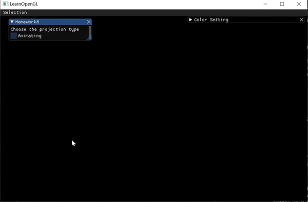
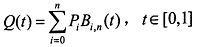
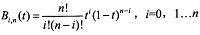
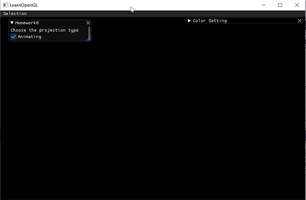
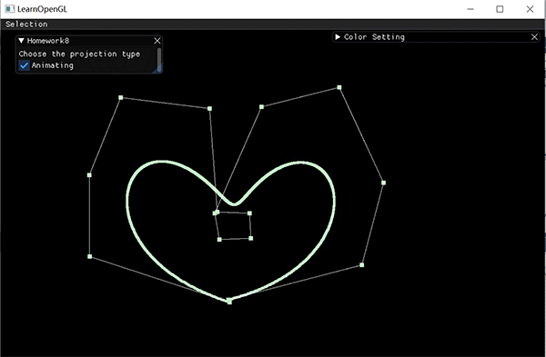

# Homework 9 - Bezier Curve
## Introduction
    本次作业要求大家实现一个Bezier Curve的绘制小工具。此工具可以接受鼠标输入。

# Homework
## Basic:
### 1. 用户能通过左键点击添加Bezier曲线的控制点，右键点击则对当前添加的最后一个控制点进行消除
### 2. 工具根据鼠标绘制的控制点实时更新Bezier曲线。
效果如图  
  

### 首先实现鼠标点击的响应
添加鼠标点击回调函数和移动的回调函数  
```
//鼠标移动回调函数
void cursorPosCallback(GLFWwindow* window, double xpos, double ypos) {
	posX = xpos;
	posY = ypos;
}

//鼠标点击回调函数  
void mouseButtonCallback(GLFWwindow* window, int button, int action, int mods) {
	leftButton = action == GLFW_PRESS && button == GLFW_MOUSE_BUTTON_LEFT;
	rightButton = action == GLFW_PRESS && button == GLFW_MOUSE_BUTTON_RIGHT;
}
```  

注册回调函数  
```
glfwSetMouseButtonCallback(window, mouseButtonCallback);
glfwSetCursorPosCallback(window, cursorPosCallback);
```

在渲染中捕捉到点击事件，左键按下时，针对当前鼠标位置，添加一个控制点；右键按下时删除最新的控制点。  
这里除了回调函数所用变量外，在我的HW8类里也设置了按键变量，因为我发现如果不这么弄，渲染函数里会捕捉不到这一变化，可能是因为延迟。。   
```
	// 左键按下
	if (leftMouse == false && leftButton == true) {
		if (pointsIn.size() < 21) {
			pointsIn.push_back(glm::vec2(posX, posY));
		}
	}
	leftMouse = leftButton;
	// 右键按下
	if (rightMouse == false && rightButton == true) {
		if (pointsIn.size() > 0) 
			pointsIn.pop_back();
	}
	rightMouse = rightButton;
```

### 绘制控制点
将鼠标点击位置坐标转化为屏幕坐标，构成要绘制的顶点数组  
```
// 生成顶点数组
void HW8::generateVertices(vector<glm::vec2> points) {
	for (int i = 0; i < points.size(); i++) {
		vertices[i * 2 + 0] = (points[i].x / width)*2 - 1;
		vertices[i * 2 + 1] = -((points[i].y / height)*2 - 1);
	}
}
```  

着色器中只使用2维坐标  
```
//顶点着色器
#version 330 core
layout (location = 0) in vec2 aPos;

void main()
{
   gl_Position = vec4(aPos, 0.0, 1.0);
}


// 片段着色器
#version 330 core
out vec4 FragColor;
uniform vec3 ourColor;

void main()
{
	FragColor = vec4(ourColor, 1.0);
}
```
创建顶点数组，生成并绑定顶点数组对象VAO，再生成顶点数据缓冲对象VBO并绑定。将顶点数据复制到缓冲的内存，解析顶点数据，绘制顶点  
```
void HW8::drawPoints(int count, int size, bool subline) {
	if (count < 1) return;
	unsigned int VBO, VAO;
	//顶点
	glGenVertexArrays(1, &VAO);
	glGenBuffers(1, &VBO);
	glBindVertexArray(VAO);
	//VBO
	glBindBuffer(GL_ARRAY_BUFFER, VBO);
	// 点的大小
	glPointSize(size);
	//把之前定义的顶点数据复制到缓冲的内存
	glBufferData(GL_ARRAY_BUFFER, sizeof(vertices), vertices, GL_STATIC_DRAW);
	//使用glVertexAttribPointer函数告诉OpenGL该如何解析顶点数据
	//位置
	glVertexAttribPointer(0, 2, GL_FLOAT, GL_FALSE, 2 * sizeof(float), (void*)0);
	glEnableVertexAttribArray(0);
	// 解除绑定
	glBindBuffer(GL_ARRAY_BUFFER, 0);
	glDrawArrays(GL_POINTS, 0, count);
	if (subline) {
		glDrawArrays(GL_LINE_STRIP, 0, count);
	}
	glBindVertexArray(0);
	glDeleteVertexArrays(1, &VAO);
	glDeleteBuffers(1, &VBO);
	
}
```

绘制控制点大小为10，再以GL_LINE_STRIP绘线方式绘制辅助线，大小为5  
```
	generateVertices(pointsIn);
	int num = pointsIn.size();
	myShader.use();
	myShader.setVec3("ourColor", color_setting.x, color_setting.y, color_setting.z);
	drawPoints(num);
	myShader.setVec3("ourColor", 1.0, 1.0, 1.0);
	drawPoints(num, 5, true);
```

### 绘制Bezier曲线
Bézier curve本质上是由调和函数（ Harmonic functions） 根据控制点
（ Control points） 插值生成。其参数方程如下：  
  
上式为𝑛次多项式，具有 𝑛 + 1项。其中， 𝑃𝑖(𝑖 = 0, 1 … 𝑛)表示特征多边形的𝑛 + 1个顶点向量； 𝐵𝑖,𝑛(𝑡)为伯恩斯坦（ Bernstein）基函数，其多项式表示为：  
  

首先计算Bernstein 基函数
```
float HW8::Bernstein(int i, int n, float t) {
	long long int a = calFactorial(i) * calFactorial(n - i);
	float res = calFactorial(n) / a;
	res *= pow(t, i) * pow(1 - t, n - i);
	return res;
}
```

其中阶乘的计算使用了数组存储已计算好的结果，节省内存，使用long long int最多可以计算到21的阶乘
```
long long int HW8::calFactorial(int i) {
	if (i > 104) return 1;
	for (; computedFac <= i; computedFac++) {
		factorialTmp[computedFac] = factorialTmp[computedFac - 1] * computedFac;
	}
	return factorialTmp[i];
}
```

接着绘制beizer曲线，将所有计算出来的点用一个vector数组存储，然后转化成屏幕坐标，再绘制
```
	//绘制beizer曲线
	if (num > 1) {
		for (float t = 0; t < 1; t += 0.001) {
			glm::vec2 p = pointsIn[0] * Bernstein(0, num - 1, t);
			for (int i = 1; i < num; i++) {
				p = p + pointsIn[i] * Bernstein(i, num - 1, t);
			}
			pointsOut.push_back(p);
		}
		generateVertices(pointsOut);
		drawPoints(pointsOut.size(), 6);
		pointsOut.clear();
	}
```  

## Bonus:
### 1. 实现光源在正交/透视两种投影下的Shadowing Mapping1. 可以动态地呈现Bezier曲线的生成过程。
效果如图  
  
  

思路是依次在控制点构成的每条线段中找一个点，绘制这组点的连线，并将其作为新的点数组，在这些点构成的每条线段中再找一个点，连线，如此递归直到最后的点数组只有1个  
```
	// 动态呈现
	if (num > 1 && animate) {
		frameT += 0.001;
		if (frameT > 1) frameT = 0;
		float t = frameT;

		myShader.setVec3("ourColor", 0.86, 0.08, 0.24);
		glm::vec2 p = pointsIn[0] * Bernstein(0, pointsIn.size() - 1, t);
		for (int i = 1; i < this->pointsIn.size(); i++) {
			p = p + pointsIn[i] * Bernstein(i, pointsIn.size() - 1, t);
		}
		pointsOut.push_back(p);
		generateVertices(pointsOut);
		drawPoints(pointsOut.size());
		pointsOut.clear();

		myShader.setVec3("ourColor", 1.0, 1.0, 1.0);
		pointsOut.insert(pointsOut.end(), pointsIn.begin(), pointsIn.end());
		while (num > 1) {
			int newCount = 0;
			for (int i = 0; i < num - 1; i++) {
				glm::vec2 p = pointsOut[i] * (1 - t) + pointsOut[i + 1] * t;
				pointsOut.push_back(p);
			}
			pointsOut.erase(pointsOut.begin(), pointsOut.begin() + num);
			generateVertices(pointsOut);
			drawPoints(pointsOut.size(), 5, true);
			
			num--;
		}
		pointsOut.clear();
	}
```
